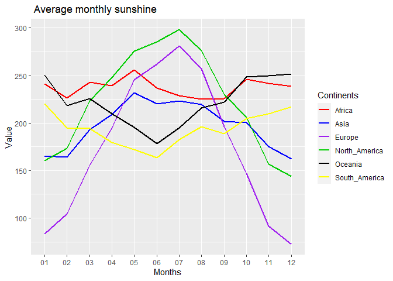

R Notebook
================

## List of cities by sunshine duration

#### I loaded thhe main packages (Tidyverse and rvest)

``` r
rm(list=ls())
library(tidyverse)
```

    ## Warning: Paket 'ggplot2' wurde unter R Version 4.2.3 erstellt

    ## Warning: Paket 'tibble' wurde unter R Version 4.2.3 erstellt

    ## Warning: Paket 'dplyr' wurde unter R Version 4.2.3 erstellt

    ## ── Attaching core tidyverse packages ──────────────────────── tidyverse 2.0.0 ──
    ## ✔ dplyr     1.1.2     ✔ readr     2.1.4
    ## ✔ forcats   1.0.0     ✔ stringr   1.5.0
    ## ✔ ggplot2   3.4.2     ✔ tibble    3.2.1
    ## ✔ lubridate 1.9.2     ✔ tidyr     1.3.0
    ## ✔ purrr     1.0.1     
    ## ── Conflicts ────────────────────────────────────────── tidyverse_conflicts() ──
    ## ✖ dplyr::filter() masks stats::filter()
    ## ✖ dplyr::lag()    masks stats::lag()
    ## ℹ Use the conflicted package (<http://conflicted.r-lib.org/>) to force all conflicts to become errors

``` r
library(rvest)
```

    ## 
    ## Attache Paket: 'rvest'
    ## 
    ## Das folgende Objekt ist maskiert 'package:readr':
    ## 
    ##     guess_encoding

## loading the url and reading the html data

#### Here I link the URL and read it into R. Data exist in table form so its easy to define htm/element or nodes as “table”. The output is therefore a list

``` r
url <- "https://en.wikipedia.org/wiki/List_of_cities_by_sunshine_duration"

tab <- read_html(url)

All_list <- tab %>% html_elements("table") %>% html_table()
```

## scraping the individual continents

#### Next I pluck each continent out of the list using their position in the list

``` r
Africa <- All_list %>% pluck(3)%>% select(!Ref.) %>%
         mutate(Continent = "Africa") %>% 
         select(Country, City, Continent, everything())


Asia <- All_list %>% pluck(4) %>% select(!Ref.) %>%
          mutate(Continent = "Asia") %>% 
         select(Country, City, Continent, everything())

Europe <- All_list %>% pluck(5) %>% select(!Ref.) %>%
          mutate(Continent = "Europe") %>% 
         select(Country, City, Continent, everything())

North_America <- All_list %>% pluck(6) %>% select(!Ref.) %>%
          mutate(Continent = "North_America") %>% 
         select(Country, City, Continent, everything())

South_America <- All_list %>% pluck(7) %>% select(!Ref.) %>%
          mutate(Continent = "South_America") %>% 
         select(Country, City, Continent, everything())

Oceania <- All_list %>% pluck(8) %>% select(!Ref.) %>%
          mutate(Continent = "Oceania") %>% 
         select(Country, City, Continent, everything())
```

## Combining data into one master data

#### I combine all the continents (plucked from the list) into one master dataframe.

``` r
master_data <- bind_rows(Africa, Asia, Europe,North_America,
                         South_America, Oceania)
head(master_data)
```

    ## # A tibble: 6 × 16
    ##   Country  City  Continent   Jan   Feb   Mar   Apr   May   Jun   Jul   Aug   Sep
    ##   <chr>    <chr> <chr>     <dbl> <dbl> <dbl> <dbl> <dbl> <dbl> <dbl> <dbl> <dbl>
    ## 1 Ivory C… Gagn… Africa     183   180   196   188   181   118    97    80   110 
    ## 2 Ivory C… Boua… Africa     242   224   219   194   208   145   104    82   115 
    ## 3 Ivory C… Abid… Africa     223   223   239   214   205   128   137   125   139 
    ## 4 Ivory C… Odie… Africa     242   220.  217.  215.  249.  222.  184.  174.  185.
    ## 5 Ivory C… Ferké Africa     279   249   253   229   251   221   183   151   173 
    ## 6 Benin    Coto… Africa     214.  210   223.  219   214.  141   136.  149.  165 
    ## # ℹ 4 more variables: Oct <dbl>, Nov <dbl>, Dec <dbl>, Year <chr>

``` r
tail(master_data)
```

    ## # A tibble: 6 × 16
    ##   Country  City  Continent   Jan   Feb   Mar   Apr   May   Jun   Jul   Aug   Sep
    ##   <chr>    <chr> <chr>     <dbl> <dbl> <dbl> <dbl> <dbl> <dbl> <dbl> <dbl> <dbl>
    ## 1 New Zea… Chri… Oceania    224.  190.  177.  156.  133. 118.   125.  149   167.
    ## 2 New Zea… Well… Oceania    240.  205   195.  154.  126  102.   111.  137.  163.
    ## 3 New Zea… Hami… Oceania    230.  193.  193.  165.  138. 113.   126.  144.  148.
    ## 4 New Zea… Auck… Oceania    229.  195.  189.  157.  140. 110.   128.  143.  149.
    ## 5 Fiji     Suva  Oceania    192.  178   170.  153   146. 141    136.  143.  135 
    ## 6 New Zea… Dune… Oceania    180.  158   146.  126.  108.  95.3  111.  122.  137.
    ## # ℹ 4 more variables: Oct <dbl>, Nov <dbl>, Dec <dbl>, Year <chr>

#### Next I tried to compute the average sunshine for each continent by computing their monthly means.

``` r
Africa_mean <- master_data %>% filter(Continent == "Africa") %>%
              summarise(across(where(is.numeric), ~mean(.x)))
Asia_mean <- master_data %>% filter(Continent == "Asia") %>%
              summarise(across(where(is.numeric), ~mean(.x)))
Europe_mean <- master_data %>% filter(Continent == "Europe") %>%
              summarise(across(where(is.numeric), ~mean(.x)))
NA_mean <- master_data %>% filter(Continent == "North_America") %>%
              summarise(across(where(is.numeric), ~mean(.x)))
SA_mean <- master_data %>% filter(Continent == "South_America") %>%
              summarise(across(where(is.numeric), ~mean(.x)))
Oceania_mean <- master_data %>% filter(Continent == "Oceania") %>%
              summarise(across(where(is.numeric), ~mean(.x)))

Average_sunshine<- bind_rows(Africa_mean, Asia_mean,Europe_mean,NA_mean,
          SA_mean,Oceania_mean ) %>% mutate(Continents = 
                  c("Africa", "Asia",
                "Europe","North_America",
                 "South_America","Oceania")) %>%
                select(Continents, everything())

ploty1 <- Average_sunshine %>% pivot_longer(
                            names_to = "Months" ,
                            values_to = "Value" , -Continents)
```

#### Finally I provide a plot of the average monthly sunshine. One can notice that between May and August, North America and Europe have the average highest sunshine. Europe recorded the lowest sunshine in Winter (From October to April). African has quite a sturdy amount of sunshine throughout the year.

``` r
library(lubridate)
ploty1$Months <- parse_date_time((ploty1$Months), orders = "m") 

ploty1 <- ploty1 %>% separate(Months, into=c("Year", "Month", "Day"))%>%
    select(Continents, Month,Value)

ggplot(ploty1, aes(Month, Value))  +
   geom_line(aes(color = Continents, group = Continents), size = 1)+
  scale_color_manual(values = c("red", "blue","purple", "green3",
                                "black", "yellow"))+
   xlab("Months")+ ggtitle(" Average monthly sunshine")
```

    ## Warning: Using `size` aesthetic for lines was deprecated in ggplot2 3.4.0.
    ## ℹ Please use `linewidth` instead.
    ## This warning is displayed once every 8 hours.
    ## Call `lifecycle::last_lifecycle_warnings()` to see where this warning was
    ## generated.


